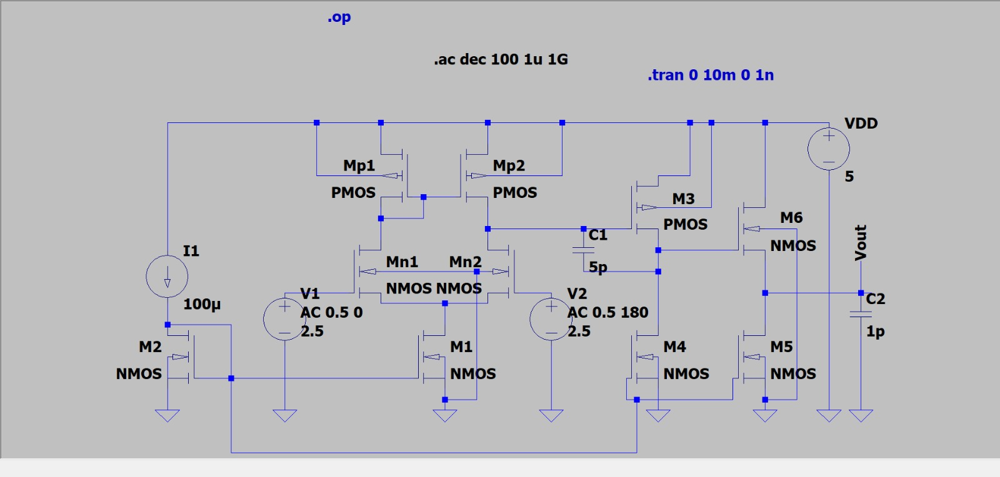
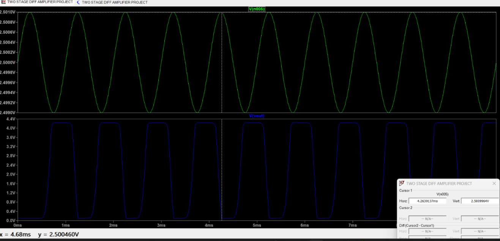

# Two-Stage CMOS Operational Amplifier Design using LTspice

## Overview

This project presents the design and simulation of a Two-Stage CMOS Operational Amplifier using LTspice.

The amplifier consists of:

- NMOS Differential Input Pair
- PMOS Current Mirror Active Load
- Common Source Second Gain Stage
- Miller Compensation Capacitor
- Capacitive Load

The design was analyzed using DC, AC, and Transient simulations to evaluate gain, frequency response, stability, power consumption, and slew rate.

---

## Circuit Schematic

---

## Design Specifications

| Parameter | Value |
|------------|------------|
| Supply Voltage (VDD) | 5 V |
| Tail Current | 100 µA |
| Compensation Capacitor (C1) | 5 pF |
| Load Capacitor (C2) | 1 pF |
| Technology | Generic CMOS (LTspice) |

---

## Transistor Dimensions

| Transistor | W (µm) | L (µm) |
|------------|---------|---------|
| Mn1, Mn2 | 20 | 1 |
| Mp1, Mp2 | 40 | 1 |
| M1, M2 | 10 | 2 |
| M3 | 40 | 1 |
| M4 | 10 | 2 |
| M5 | 10 | 2 |
| M6 | 20 | 1 |

---

## DC Operating Point Verification

The operating point simulation confirmed proper biasing of all stages.

### Differential Stage

| Quantity | Value |
|-----------|----------|
| Id(Mn1) | 50 µA |
| Id(Mn2) | 50 µA |
| Id(Mp1) | 50 µA |
| Id(Mp2) | 50 µA |

### Second Stage

| Quantity | Value |
|-----------|----------|
| Id(M3) | 50 µA |
| Id(M4) | 50 µA |
| Id(M5) | 16.8 µA |
| Id(M6) | 16.8 µA |

---

## AC Analysis

The frequency response of the amplifier was obtained using differential excitation and AC analysis.

### Bode Plot

### Measured Results

| Parameter | Value |
|------------|------------|
| Open-Loop Gain | 162 dB |
| Dominant Pole | 9 mHz |
| Second Pole | 26 MHz |
| Unity Gain Bandwidth (UGB) | 2.31 MHz |
| Phase Margin | 72° |

### Observations

- High open-loop gain achieved using two cascaded gain stages.
- Miller compensation introduced a dominant low-frequency pole.
- Phase margin of approximately 72° indicates stable operation.
- Gain rolls off at approximately −20 dB/decade after the dominant pole.

---

## Transient Analysis

Input Signal:

- DC Bias = 2.5 V
- Amplitude = 1 mV
- Frequency = 1 kHz

### Waveforms

### Observations

- Small differential input signal produces a large output swing.
- Output transitions between approximately 0.1 V and 4.2 V.
- The amplifier behaves as a high-gain open-loop amplifier and reaches saturation near the supply rails.

---

## Slew Rate Measurement

A pulse input was applied to determine the large-signal response of the amplifier.

### Slew Rate Waveforms

#### Measurement Waveform

#### Zoomed Measurement

### Calculation

Measured points:

| Voltage | Time |
|----------|----------|
| 120.003 mV | 1.0000272 ms |
| 118.096 mV | 1.0000289 ms |

Therefore:

- ΔV = 1.907 mV
- Δt = 1.7 ns

Slew Rate:

SR = ΔV / Δt

SR ≈ 1.12 V/µs

### Result

| Parameter | Value |
|------------|------------|
| Slew Rate | 1.12 V/µs |

---

## Power Dissipation

| Parameter | Value |
|------------|------------|
| Supply Voltage | 5 V |
| Supply Current | 266.8 µA |
| Power Dissipation | 1.33 mW |

---

## Final Performance Summary

| Parameter | Value |
|------------|------------|
| Supply Voltage | 5 V |
| Tail Current | 100 µA |
| Open-Loop Gain | 162 dB |
| Dominant Pole | 9 mHz |
| Second Pole | 26 MHz |
| Unity Gain Bandwidth | 2.31 MHz |
| Phase Margin | 72° |
| Slew Rate | 1.12 V/µs |
| Power Dissipation | 1.33 mW |

---

## Software Used

- LTspice

---

## Key Concepts Demonstrated

- Differential Amplifier Design
- Current Mirror Biasing
- Active Loads
- Common Source Gain Stage
- Miller Compensation
- Frequency Compensation
- Bode Plot Analysis
- Pole-Zero Effects
- Phase Margin Estimation
- Slew Rate Measurement
- CMOS Analog Circuit Design

---

